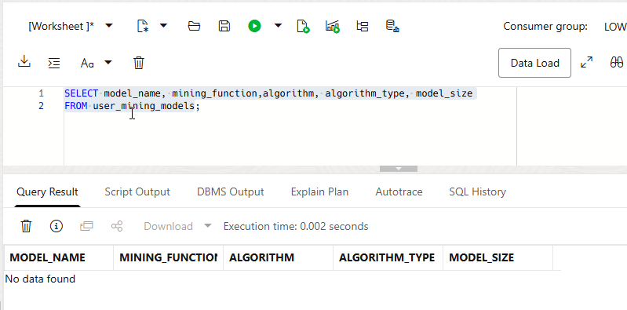
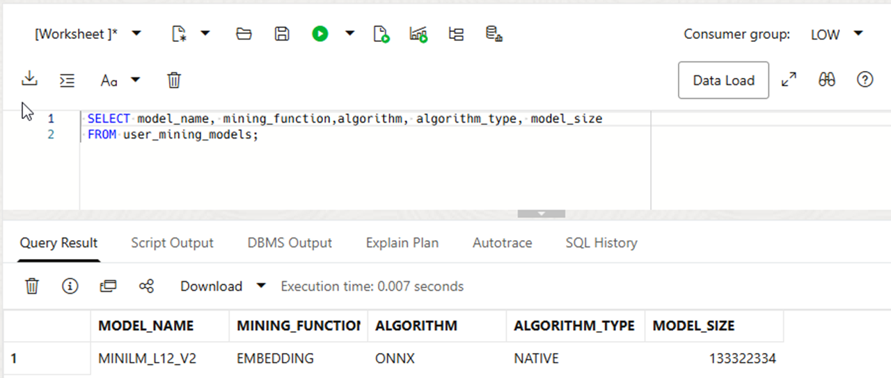

# Vector Embeddings

## Introduction

This lab loads a text-embedding model into the database. You inspect the model and view an embedding it generates. An embedding is a list of numbers that represents text meaning.

### Objectives

In this lab, you will:

* Load an embedding model into the database
* Inspect the model and its vector format
* Generate and display a vector embedding

The video shows the lab workflow.

Watch the following video.

[Vector Embeddings](https://videohub.oracle.com/media/Vector-Search-Embeddings-Lab2/1_bjgnd8ai)

### About Vector Embeddings

A Hybrid Vector Index combines keyword text search and vector similarity search. Oracle uses an embedding model for the vector part of the index. The model converts text into numerical vectors.

An embedding model converts text into a numerical vector. This vector is a list of numbers that captures semantic meaning. Text with similar meaning tends to produce nearby vectors, even when the wording differs. Store embeddings in a column with the `VECTOR` data type. A search compares vector distances to find semantically similar text.

Machine learning models generate vector embeddings. Choose a model that suits your data. Test it with representative searches. Models vary by training data, vector size, quality, licensing, and cost.

This lab uses the `all-MiniLM-L12-v2` model from sentence-transformers. It converts sentences or paragraphs into 384-dimensional vectors. A dimension is one numeric position in a vector. You do not need to interpret individual values. The supplied ONNX file is ready to load into the database. For details, see [Import Pretrained Models in ONNX Format](https://docs.oracle.com/en/database/oracle/machine-learning/oml4py/2-23ai/mlpug/import-pretrained-models-onnx-format-vector-generation-database.html).

When you create a Hybrid Vector Index, Oracle chunks the source documents. It generates an embedding for each chunk. It also maintains the vector structures. You do not need to generate these embeddings manually.

This lab lets you generate and inspect an embedding. This helps explain the representation used behind the scenes. It also prepares you for later vector-similarity and hybrid-search queries.


Estimated Time: 15 minutes

### Prerequisites

This lab assumes you have:

* An Oracle Account (oracle.com account)
* All previous labs successfully completed

## Task 1: Load an embedding model into the database

In this task, you verify that the model is not loaded. You locate the supplied ONNX file, load it, and inspect the result. The pre-built `all_MiniLM_L12_v2` model is the database-ready version described above.

1. Verify that the `all_MiniLM_L12_v2` embedding model is not already loaded:

    ```[]
    <copy>
    SELECT model_name, mining_function, algorithm, algorithm_type, model_size
    FROM user_mining_models;
    </copy>
    ```

    

2. Locate the model file. The file is in the `DATA_PUMP_DIR` database directory. Run the following SQL to list the files:

    ```[]
    <copy>
    SELECT *
    FROM (DBMS_CLOUD.LIST_FILES(directory_name=>'DATA_PUMP_DIR'));
    </copy>
    ```

    

    Workshop setup placed `all_MiniLM_L12_v2.onnx` in the operating-system directory mapped by `DATA_PUMP_DIR`. Confirm that the file appears before you continue.

3. Load the `all_MiniLM_L12_v2` embedding model into the database:

    ```[]
    <copy>
    BEGIN
      DBMS_VECTOR.LOAD_ONNX_MODEL('DATA_PUMP_DIR','all_MiniLM_L12_v2.onnx','minilm_l12_v2',
      JSON('{"function" : "embedding", "embeddingOutput" : "embedding", "input": {"input": ["DATA"]}}'));
    END;
    </copy>
    ```

    

    `DBMS_VECTOR.LOAD_ONNX_MODEL` reads the ONNX file from `DATA_PUMP_DIR`. It registers the `MINILM_L12_V2` model in the database.

4. Display the newly loaded model:

    ```[]
    <copy>
    SELECT model_name, mining_function, algorithm, algorithm_type, model_size
    FROM user_mining_models;
    </copy>
    ```

    

    Confirm that the `MINING FUNCTION` column is `EMBEDDING`. This identifies a model that generates embeddings.

5. Display the model details:

    ```[]
    <copy>
    SELECT model_name, attribute_name, attribute_type, data_type, vector_info
    FROM user_mining_model_attributes
    WHERE model_name = 'MINILM_L12_V2'
    ORDER BY 1, 3;
    </copy>
    ```

    

    Confirm that `VECTOR_INFO` displays `VECTOR(384,FLOAT32)`. This matches the 384 dimensions and `FLOAT32` numeric format.

## Task 2: Describe and display a vector

AI Vector Search adds the `VECTOR` data type to Oracle AI Database. Application tables can have one or more `VECTOR` columns. These columns store embeddings. The `all_MiniLM_L12_v2` model creates an embedding for input text. In this task, you generate an embedding and view its values. Later labs store embeddings and search them.

Define a `VECTOR` column with an optional dimension count and numeric format. If you omit both, the column can accept vectors with different dimensions and formats. This flexibility helps during exploration. Production tables normally use the dimensions and format from the selected embedding model.

The number of dimensions must be greater than zero, with a maximum of 65,535 dimensions.

The possible dimension formats are:

* `INT8` (8-bit integers)
* `FLOAT32` (32-bit IEEE floating-point numbers)
* `FLOAT64` (64-bit IEEE floating-point numbers)
* `BINARY` (packed `UINT8` bytes where each dimension is a single bit)

Generate a vector for a short piece of text. Then view it.

1. In the SQL Worksheet, run the following query to create a vector embedding for the word `hello`.

    ```[]
    <copy>
    SELECT VECTOR_EMBEDDING(minilm_l12_v2 USING 'hello' AS data);
    </copy>
    ```

    

    The result is a 384-value vector. You do not need to interpret individual values. Click the eye icon beside the truncated value to view the complete vector.

    **Proceed to the next lab**

## Learn More

* [Oracle AI Vector Search User's Guide](https://docs.oracle.com/en/database/oracle/oracle-database/26/vecse/index.html)
* [OML4Py: Leveraging ONNX and Hugging Face for AI Vector Search](https://blogs.oracle.com/machinelearning/post/oml4py-leveraging-onnx-and-hugging-face-for-advanced-ai-vector-search)
* [Oracle Database 26ai Release Notes](https://docs.oracle.com/en/database/oracle/oracle-database/23/rnrdm/index.html)
* [Oracle Documentation](http://docs.oracle.com)

## Acknowledgements
* **Author** - - Andy Rivenes, Product Manager, AI Vector Search
* **Contributors** - Ulrike Schwinn, Product Manager, AI Vector Search
* **Last Updated By/Date** - Ulrike Schwinn, August 2026

