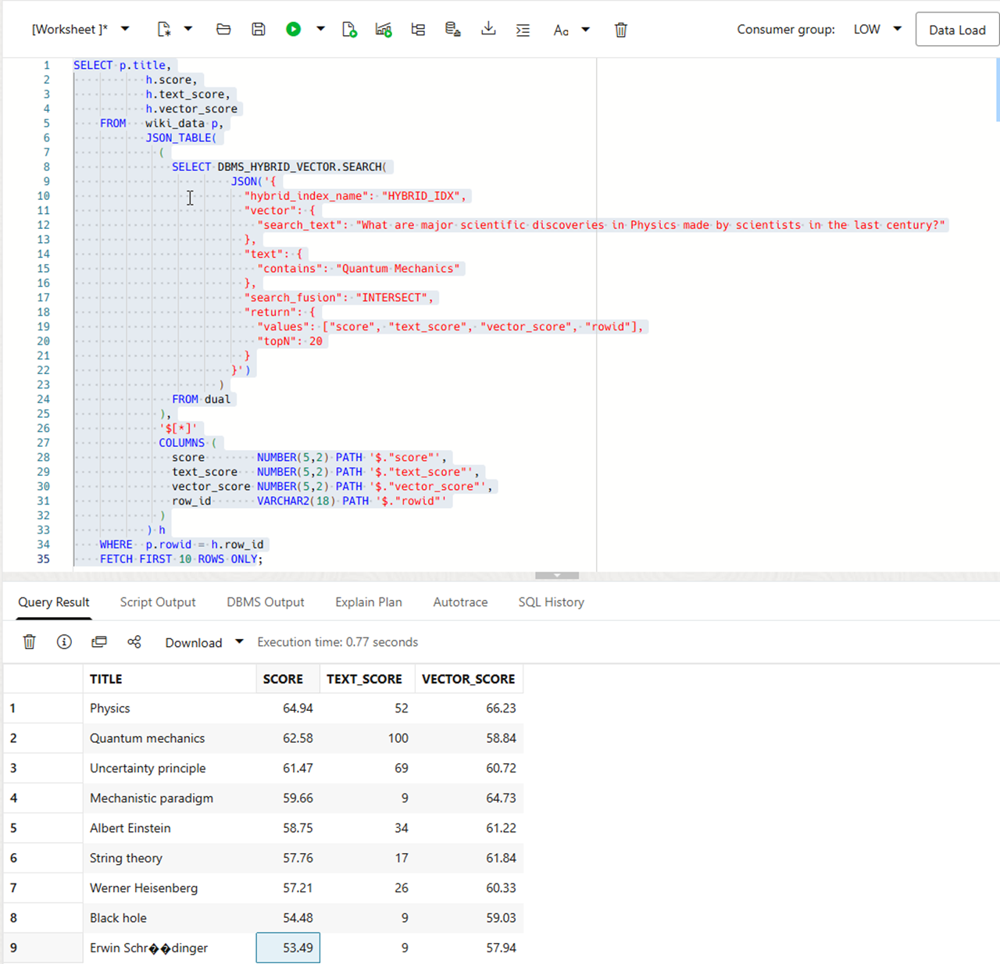
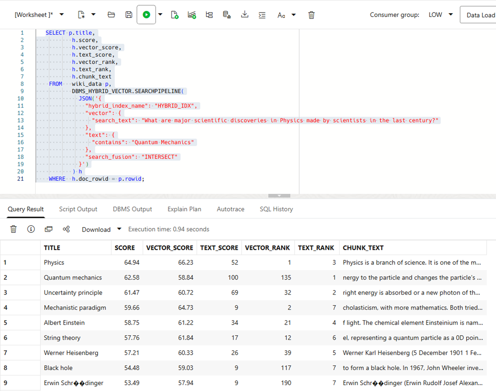
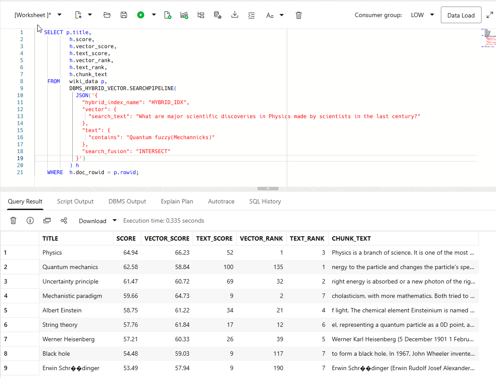
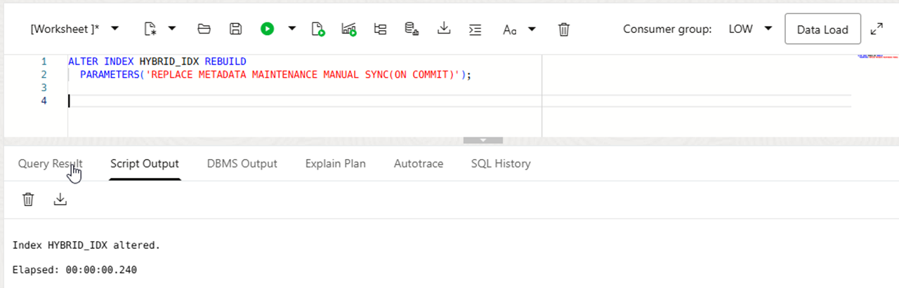
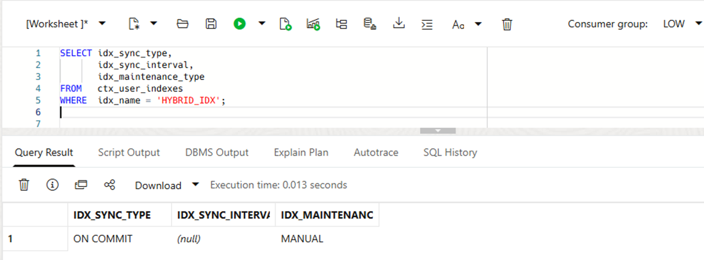
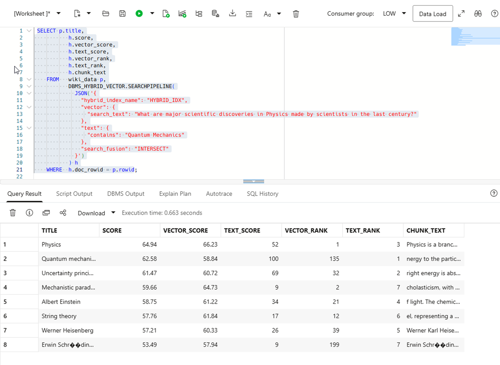

# Combine INTERSECT Fusion and Fuzzy Search

## Introduction


Hybrid vector indexes combine an Oracle AI Vector Search vector index with an Oracle Text search index. By combining keyword-based text search with vector similarity search, you can return results that meet both lexical and semantic requirements.

In the previous lab, you ran vector-only similarity searches against `HYBRID_IDX`. In this lab, you investigate hybrid search. For hybrid search, Oracle combines keyword and vector result sets into one ranked list. Fusion determines which results remain. For example, `UNION` retains results from either search. `INTERSECT` retains only results returned by both the text and vector searches.

This lab adds a keyword requirement to semantic search. It uses `search_fusion: INTERSECT` to retain only results that match both searches.

Oracle Text `CONTAINS` expressions support operators such as `OR` (`|`), `AND` (`&`), stem (`$`), and minus (`-`). For the complete list, see [Oracle Text CONTAINS Query Operators](https://docs.oracle.com/en/database/oracle/oracle-database/26/ccref/oracle-text-CONTAINS-query-operators.html).

This lab uses the Oracle Text `fuzzy()` operator. Fuzzy matching expands a keyword to similarly spelled terms that occur in the index. It helps recover matches when a user misspells a search term.

You can maintain a hybrid vector index with the same general operations as an Oracle Text index. These include synchronization, optimization, and automatic maintenance.

By default, a hybrid vector index uses `MAINTENANCE AUTO`. In this mode, base-table `INSERT`, `UPDATE`, and `DELETE` operations synchronize to the index in the background. Oracle manages the synchronization interval.

If an application requires a different synchronization policy, configure `MAINTENANCE MANUAL` and select `SYNC(MANUAL)`, `SYNC(EVERY ...)`, or `SYNC(ON COMMIT)`. You can define these settings during index creation or change them later with `ALTER INDEX`.

In this lab, you change the synchronization policy to `ON COMMIT`. After a transaction modifies indexed source text and commits, Oracle synchronizes the hybrid vector index as part of commit processing. Subsequent searches can then see the change.


### Objectives

In this lab, you will:

- Run a document-level hybrid query with `INTERSECT` fusion.
- Use `DBMS_HYBRID_VECTOR.SEARCHPIPELINE` to inspect scores, ranks and chunk text.
- Add `fuzzy()` to the Oracle Text condition.
- Compare the text, vector and the final scores returned by hybrid search.
- Update an indexed document and confirm that `SYNC(ON COMMIT)` makes the change searchable.

This lab contains four tasks.

Estimated Time: 30 minutes.

### Prerequisites

- Complete the lab that created `HYBRID_IDX`.
- Complete the vector-only similarity-search lab.
- Connect as the owner of `WIKI_DATA` and `HYBRID_IDX`.

## Task 1: Run an INTERSECT Hybrid Query

Find articles about major discoveries in physics. Require the text condition to match both `Quantum` and `Mechanics`.

1. Run the query.

    ```sql[]
    <copy>
    SELECT p.title,
           h.score,
           h.text_score,
           h.vector_score
    FROM   JSON_TABLE(
             (
               SELECT DBMS_HYBRID_VECTOR.SEARCH(
                        JSON('{
                          "hybrid_index_name": "HYBRID_IDX",
                          "vector": {
                            "search_text": "What are major scientific discoveries in Physics made by scientists in the last century?"
                          },
                          "text": {
                            "contains": "Quantum & Mechanics"
                          },
                          "search_fusion": "INTERSECT",
                          "return": {
                            "values": ["score", "text_score", "vector_score", "rowid"],
                            "topN": 20
                          }
                        }')
                      )
               FROM dual
             ),
             '$[*]'
             COLUMNS (
               score        NUMBER(5,2) PATH '$."score"',
               text_score   NUMBER(5,2) PATH '$."text_score"',
               vector_score NUMBER(5,2) PATH '$."vector_score"',
               row_id       VARCHAR2(18) PATH '$."rowid"'
             )
           ) h
           JOIN wiki_data p ON p.rowid = h.row_id
    FETCH FIRST 10 ROWS ONLY;
    </copy>
    ```

2. Inspect the results.

    `INTERSECT` retains only rows common to the text and vector result sets. A qualifying result has both `text_score > 0` and `vector_score > 0`. The query can therefore return fewer than ten rows. Our result includes nine rows. The final `score` uses the configured hybrid-search scorer. Treat it as the ranking value for this result set, not as the same scale as either component score.

    Compare the results with the `VECTOR_ONLY` query from the previous lab. A strong semantic match does not qualify unless the document also satisfies the Oracle Text condition.
    See the image below:

    

## Task 2: Inspect Ranks and Chunk Text with SEARCHPIPELINE

`DBMS_HYBRID_VECTOR.SEARCHPIPELINE` returns a pipeline of result records. It avoids manual `JSON_TABLE` parsing and exposes score, rank, and chunk fields for use in SQL.

1. Run the query.

    ```sql[]
    <copy>
    SELECT p.title,
           h.score,
           h.vector_score,
           h.text_score,
           h.vector_rank,
           h.text_rank,
           h.chunk_text
    FROM   wiki_data p,
           DBMS_HYBRID_VECTOR.SEARCHPIPELINE(
             JSON('{
               "hybrid_index_name": "HYBRID_IDX",
               "vector": {
                 "search_text": "What are major scientific discoveries in Physics made by scientists in the last century?"
               },
               "text": {
                 "contains": "Quantum Mechanics"
               },
               "search_fusion": "INTERSECT"
             }')
           ) h
    WHERE  h.doc_rowid = p.rowid;
    </copy>
    ```

2. Compare the rank columns.

    `TEXT_RANK` measures keyword relevance. `VECTOR_RANK` measures semantic relevance. A row can rank highly for one signal and lower for the other, but `INTERSECT` requires both signals to match.

    `CHUNK_TEXT` contains the passage that matched. In a retrieval-augmented generation workflow, this is the text you would provide to an LLM as supporting context.
    See the image below:

    


## Task 3: Add Fuzzy Matching to the Text Filter

Oracle Text `fuzzy()` expands a term to similarly spelled terms that exist in the index. This helps recover matches when a search term contains a typo.

1. Run the query with a misspelled form of `Mechanics`.

    ```[]
    <copy>
     SELECT p.title,
           h.score,
           h.vector_score,
           h.text_score,
           h.vector_rank,
           h.text_rank,
           h.chunk_text
    FROM   wiki_data p,
           DBMS_HYBRID_VECTOR.SEARCHPIPELINE(
             JSON('{
               "hybrid_index_name": "HYBRID_IDX",
               "vector": {
                 "search_text": "What are major scientific discoveries in Physics made by scientists in the last century?"
               },
               "text": {
                 "contains": "Quantum & fuzzy(Mechannicks)"
               },
               "search_fusion": "INTERSECT"
             }')
           ) h
    WHERE  h.doc_rowid = p.rowid;
    </copy>
    ```

2. Inspect the results.

    Oracle Text expands `Mechannicks` only to similar terms that are present in the index. Therefore, the exact rows and scores depend on the indexed content and its language configuration. `INTERSECT` still requires both a text match and a vector match; fuzzy matching changes only the text-search candidates.

    Compare the results with Task 1. If the index contains `Mechanics` and it meets the fuzzy threshold, the misspelled query returns the document.

    See the image below:

    

## Task 4: Update a document and search again

By default, a hybrid vector index uses `MAINTENANCE AUTO`, which synchronizes DML changes in the background at Oracle-managed intervals. To make synchronization predictable for this lab, change the maintenance mode to `MAINTENANCE MANUAL` with `SYNC(ON COMMIT)`.

1. Run the following `ALTER INDEX` command to change the synchronization mode.

    ```[]
    <copy>
    ALTER INDEX HYBRID_IDX REBUILD
      PARAMETERS('REPLACE METADATA MAINTENANCE MANUAL SYNC(ON COMMIT)');
    </copy>
    ```

    With `REPLACE METADATA`, the `REBUILD` operation updates index metadata rather than rebuilding all index data. The operation therefore completes quickly. After this change, inserts, updates, and deletes synchronize to the index during `COMMIT`, rather than at Oracle-managed background intervals.

   See the image below:

    

  

2. Check the status in the `CTX_USER_INDEXES` view.

    ```[]
    <copy>
    SELECT idx_sync_type,
           idx_sync_interval,
           idx_maintenance_type
    FROM   ctx_user_indexes
    WHERE  idx_name = 'HYBRID_IDX';
    </copy>
    ```

    


3. Replace the text for the `Black hole` sample row and commit the transaction.

    This step deliberately replaces the indexed text for one workshop row with a blank value. Do not use this statement on production data.

    ```[]
    <copy>
    UPDATE wiki_data
    SET    text = ' '
    WHERE  title = 'Black hole';

    COMMIT;
    </copy>
    ```

    

4. Run the query from Task 2 again and compare the results.
    
    ```[]
    <copy>
    SELECT p.title,
           h.score,
           h.vector_score,
           h.text_score,
           h.vector_rank,
           h.text_rank,
           h.chunk_text
    FROM   wiki_data p,
           DBMS_HYBRID_VECTOR.SEARCHPIPELINE(
             JSON('{
               "hybrid_index_name": "HYBRID_IDX",
               "vector": {
                 "search_text": "What are major scientific discoveries in Physics made by scientists in the last century?"
               },
               "text": {
                "contains": "Quantum & Mechanics"
               },
               "search_fusion": "INTERSECT"
             }')
           ) h
    WHERE  h.doc_rowid = p.rowid;
    </copy>
    ```
    

    The result now has eight rows and no longer includes the document titled `Black hole`.

## Wrap-up

This lab used three hybrid retrieval patterns:

- `VECTOR_ONLY` returns rows that are semantically close to the question.
- `INTERSECT` returns rows that are semantically close and match the text condition.
- `INTERSECT` with `fuzzy()` returns rows that meet both conditions when the text term is misspelled.

`UNION` broadens recall by retaining rows from either search signal. `TEXT_ONLY` returns keyword-driven results. Both use the same JSON query structure with a different `search_fusion` value.

You also changed hybrid-index maintenance to `SYNC(ON COMMIT)` and confirmed that a committed source-text update affects subsequent searches.

## Learn More

- [DBMS_HYBRID_VECTOR](https://docs.oracle.com/en/database/oracle/oracle-database/26/arpls/dbms_hybrid_vector1.html)
- [Query Hybrid Vector Indexes: End-to-End Example](https://docs.oracle.com/en/database/oracle/oracle-database/26/vecse/query-hybrid-vector-indexes-end-end-example.html)
- [Oracle Text CONTAINS Query Operators](https://docs.oracle.com/en/database/oracle/oracle-database/26/ccref/oracle-text-CONTAINS-query-operators.html)

## Acknowledgements

* **Author** - TODO
* **Last Updated By/Date** - TODO
