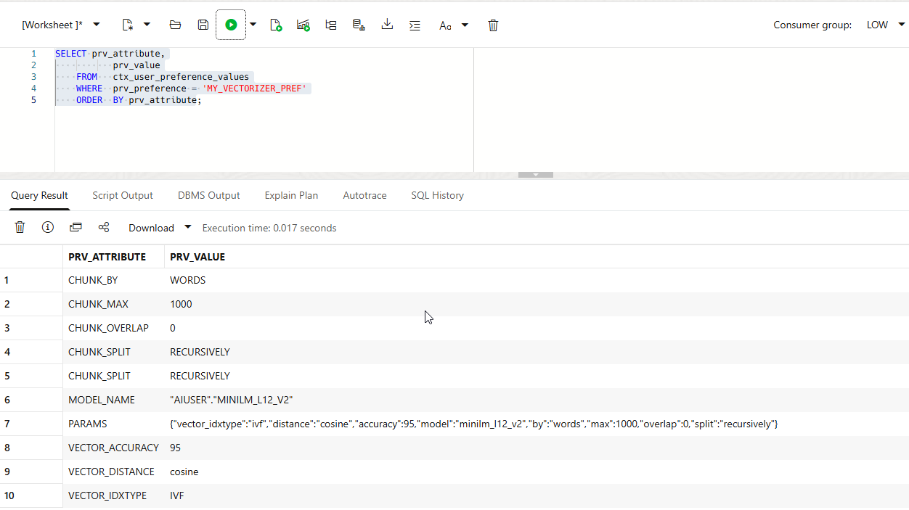
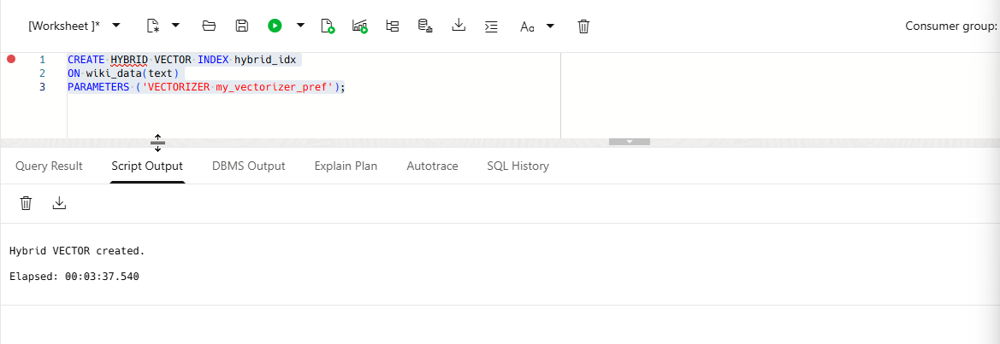
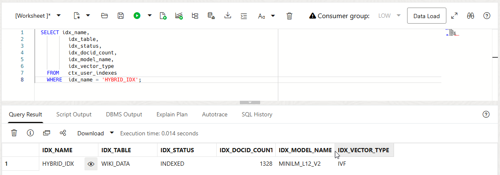
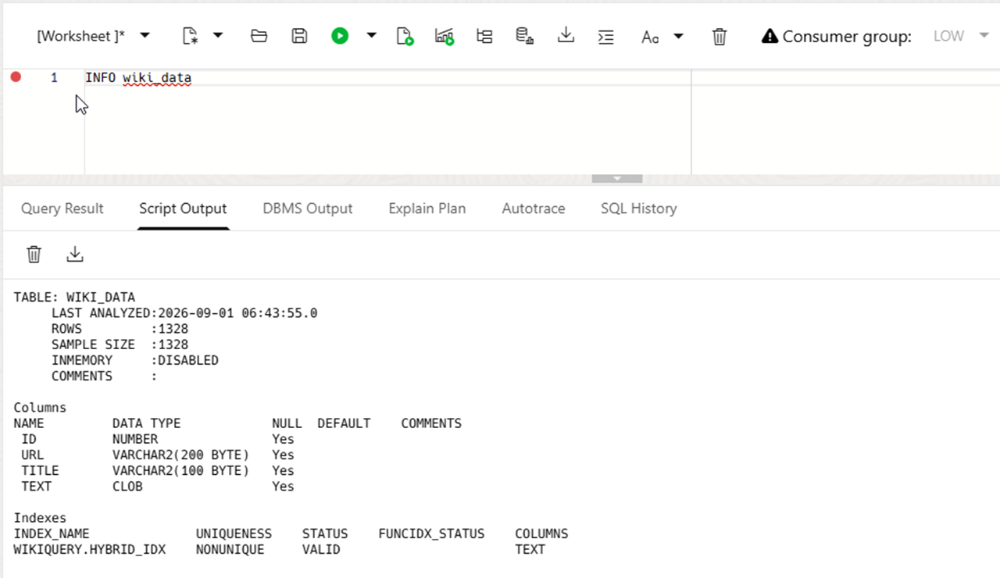
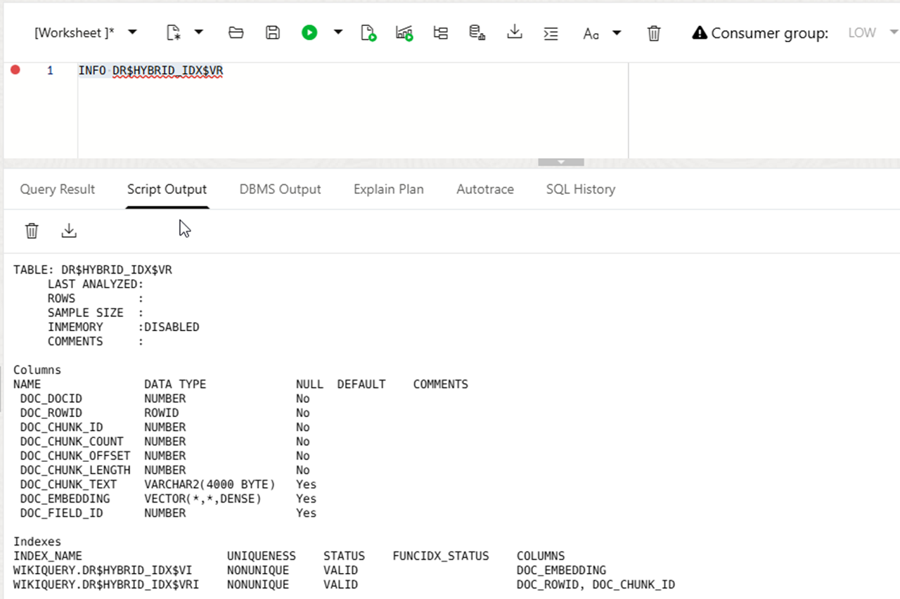
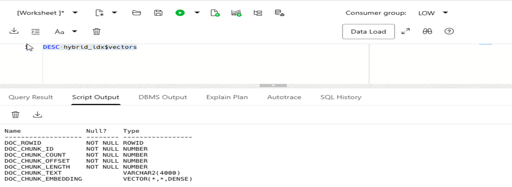
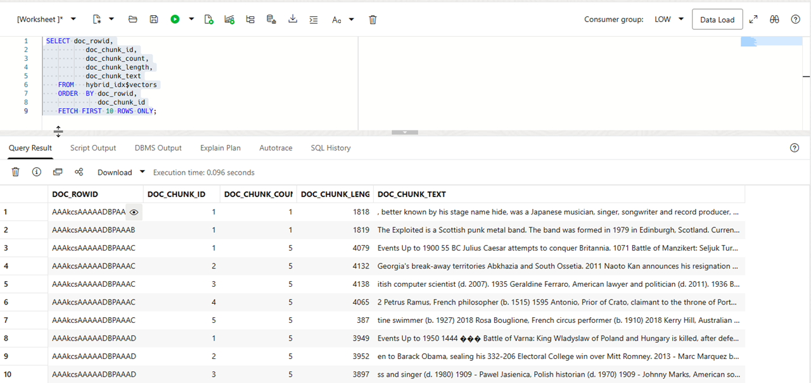
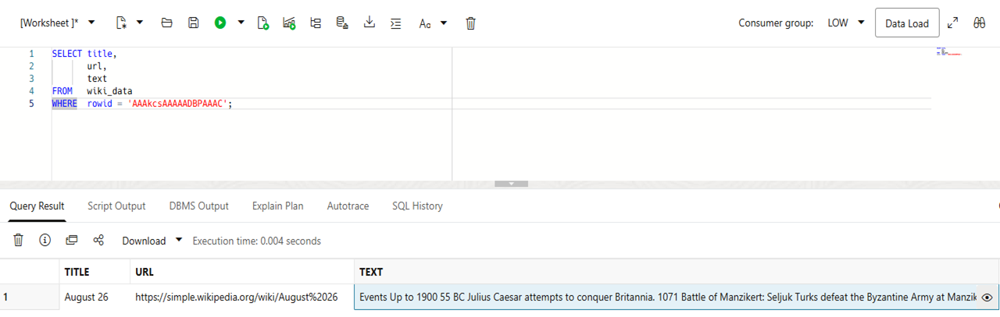

# Create a Hybrid Vector Index

## Introduction

Keyword search finds exact words or phrases from a query. Vector search finds content with similar meaning, even when it uses different words. Hybrid search combines both approaches. It can return exact matches and relevant passages that keyword search alone might miss. A hybrid vector index stores both search methods in one index. 

Oracle prepares data for vector search during hybrid vector index creation. It splits each source document into smaller pieces called chunks. It then generates an embedding for every chunk. For example, a 20-page PDF becomes smaller sections, each with its own embedding. Search can then find a relevant passage instead of matching only the whole document. You do not need a separate chunk table or embedding pipeline.

### How Hybrid Vector Index Creation Works

When you run `CREATE HYBRID VECTOR INDEX`, Oracle reads documents from a datastore. The default `DIRECT_DATASTORE` reads data from a database column. Each row becomes one document. Oracle then processes each document as follows:

1. **Filter** converts binary documents, such as PDFs, Word files, and Excel files, to plain text.
2. **Tokenizer** prepares text for keyword search. **Vectorizer** creates chunks and their embeddings for vector search.
3. **Indexing engine** creates and populates the secondary index tables.

As the system passes documents through this indexing engine, it populates and indexes a set of secondary tables that makes up a hybrid vector index. 

Oracle creates two key secondary tables.

- `$I`, which contains the inverted index with tokenized terms.
- `$VR`, which contains indexed chunks and their embeddings. It also stores a `ROWID` that maps to the source-table row and a `DOCID` that maps to the Oracle Text document ID. These values link chunks, tokens, and source documents. Use the `<index_name>$VECTORS` view to inspect row IDs, chunks, and embeddings instead of querying `$VR` directly.

In this lab, you create the `HYBRID_IDX` hybrid vector index on the `TEXT` column of `WIKI_DATA`. You create and use a named vectorizer preference, then inspect the index metadata and generated chunks.

### Objectives

In this lab, you will:

- Review the minimal DDL for a hybrid vector index.
- Create a vectorizer preference and use it to create the hybrid vector index.
- Verify the index status and the indexed table column.
- Examine the generated chunk view.

Estimated Time: 20 minutes

### Prerequisites

- Complete the previous lab, including loading the `MINILM_L12_V2` in-database ONNX model.
- Connect as the owner of `WIKI_DATA`.

## Task 1: Create the Hybrid Vector Index

1. Review the basic `CREATE HYBRID VECTOR INDEX` statement. This example includes only the minimum required parameters.

    Do not run this example. The next steps create the workshop-specific configuration.

    ```
    /*
    CREATE HYBRID VECTOR INDEX hybrid_idx
      ON wiki_data(text)
    PARAMETERS ('MODEL minilm_l12_v2');
    */
    ```

    `MODEL` identifies the model that generates vectors for input text. Oracle creates an Inverted File Flat (IVF) vector index by default. For larger indexes, test explicit memory and parallelism settings.

2. Create the vectorizer preference `my_vectorizer_pref` which stores the chunking, embedding, and indexing settings.

    ```[]
    <copy>
    BEGIN
      DBMS_VECTOR_CHAIN.CREATE_PREFERENCE(
        'my_vectorizer_pref',
        DBMS_VECTOR_CHAIN.VECTORIZER,
        JSON('{
          "vector_idxtype" : "ivf",
          "distance"       : "cosine",
          "accuracy"       : 95,
          "model"          : "minilm_l12_v2",
          "by"             : "words",
          "max"            : 1000,
          "overlap"        : 0,
          "split"          : "recursively"
        }')
      );
    END;
    /
    </copy>
    ```

    This workshop uses word-based chunks of up to 1,000 words with no overlap. Zero overlap makes chunk counts easier to inspect. In production, use a small overlap when chunks need to retain context across their boundaries. Oracle recursively splits text at natural boundaries, such as paragraphs and sentences. The index uses cosine distance, IVF, and a target accuracy of 95. Use the distance metric that matches the embedding model; cosine is appropriate for this `MINILM_L12_V2` configuration.

3. Review the stored preference values.

    ```[]
    <copy>
    SELECT prv_attribute,
           prv_value
    FROM   ctx_user_preference_values
    WHERE  prv_preference = 'MY_VECTORIZER_PREF'
    ORDER  BY prv_attribute;
    </copy>
    ```

    See the image below:

    

    The view exposes the stored preference values for the current schema. Use `CTX_PREFERENCE_VALUES` when you need to inspect preferences outside the current schema and have the required access.

4. Create the index with the reusable `my_vectorizer_pref` preference.

    Index creation can take several minutes. Oracle processes each source row, creates chunks, generates embeddings, and builds the vector-search component. In this workshop environment, it takes about 3 minutes and 40 seconds.

    ```[]
    <copy>
    CREATE HYBRID VECTOR INDEX hybrid_idx
      ON wiki_data(text)
    PARAMETERS ('VECTORIZER my_vectorizer_pref');
    </copy>
    ```

    See the image below:

    

## Task 2: Verify Hybrid Index Metadata

1. Verify that Oracle Text reports the index as indexed. Then compare its document count with the source-table row count.

    ```[]
    <copy>
    SELECT idx_name,
           idx_table,
           idx_status,
           idx_docid_count,
           idx_model_name,
           idx_vector_type
    FROM   ctx_user_indexes
    WHERE  idx_name = 'HYBRID_IDX';
    </copy>
    ```

    `IDX_STATUS` should be `INDEXED`. If the document count differs from the table row count, inspect the index errors before you search the index.

    See the image below:

    

2. Check for index errors.

    ```[]
    <copy>
    SELECT *
    FROM   ctx_user_index_errors;
    </copy>
    ```

    A successful build returns no rows. If this query returns errors, resolve them and recreate the index before continuing.

3. Confirm that `HYBRID_IDX` indexes the expected table column. Use `INFO`, a SQLcl or SQL*Plus command, to display information about `WIKI_DATA`. `INFO` is a client command, not a SQL statement.

    ```[]
    <copy>
    INFO wiki_data
    </copy>
    ```

    The output displays information about `WIKI_DATA` including its columns, data types, statistics, and indexes.

    See the image below:

    

## Task 3: Inspect the Generated Objects

During index creation, Oracle splits each source document into chunks and generates an embedding for each chunk.

`DR$HYBRID_IDX$VR` is the internal secondary Oracle Text table for the vector part of the hybrid index. It stores document chunks, metadata, and generated embeddings.

For querying or inspecting this data, use the associated view `HYBRID_IDX$VECTORS` rather than accessing the internal $VR table directly.

1. Inspect the internal table `DR$HYBRID_IDX$VR`.

    ```[]
    <copy>
    INFO DR$HYBRID_IDX$VR
    </copy>
    ```

    See the image below:

    

2. Describe the `HYBRID_IDX$VECTORS` view.

    ```[]
    <copy>
    DESC hybrid_idx$vectors
    </copy>
    ```

    For direct inspection, use the `HYBRID_IDX$VECTORS` view instead of the internal table. The view includes document and chunk identifiers, chunk offsets and text, and the `DOC_EMBEDDING` vector column.

    See the image below:

    

3. Query a small sample of the generated chunks.

    ```[]
    <copy>
    SELECT doc_rowid,
           doc_chunk_id,
           doc_chunk_count,
           doc_chunk_length,
           doc_chunk_text
    FROM   hybrid_idx$vectors
    ORDER  BY doc_rowid,
              doc_chunk_id
    FETCH FIRST 10 ROWS ONLY;
    </copy>
    ```

    Every chunk has an embedding. Hybrid search can therefore retrieve a relevant passage while preserving its relationship to the original document.

    See the image below:

    

4. Compare one returned chunk with its source document.

    ```[]
    <copy>
    SELECT title,
           url,
           text
    FROM   wiki_data
    WHERE  rowid = 'replace-with-doc_rowid';
    </copy>
    ```

    Copy a `DOC_ROWID` value from the previous query and replace `replace-with-doc_rowid`, keeping the single quotes. Compare `DOC_CHUNK_TEXT` with the source row. This shows where Oracle splits the document while retaining its source-row relationship.

    See the image below:

    

    **Proceed to the next lab**

## Learn More

- [Understand Hybrid Vector Indexes](https://docs.oracle.com/en/database/oracle/oracle-database/26/vecse/understand-hybrid-vector-indexes.html)
- [Create Hybrid Vector Indexes](https://docs.oracle.com/en/database/oracle/oracle-database/26/vecse/create-hybrid-vector-index.html)
- [Hybrid Vector Index Guidelines and Restrictions](https://docs.oracle.com/en/database/oracle/oracle-database/26/vecse/guidelines-and-restrictions-hybrid-vector-indexes.html)
- [Vector Index and Hybrid Vector Index Views](https://docs.oracle.com/en/database/oracle/oracle-database/26/vecse/vector-index-and-hybrid-vector-index-views.html)

Next, query `HYBRID_IDX` with keyword, semantic, and hybrid searches.

## Acknowledgements

**Author** - - Ulrike Schwinn, Product Manager, AI Vector Search
**Contributors** - Andy Rivenes, Product Manager, AI Vector Search
**Last Updated By/Date** - Ulrike Schwinn, August 2026
