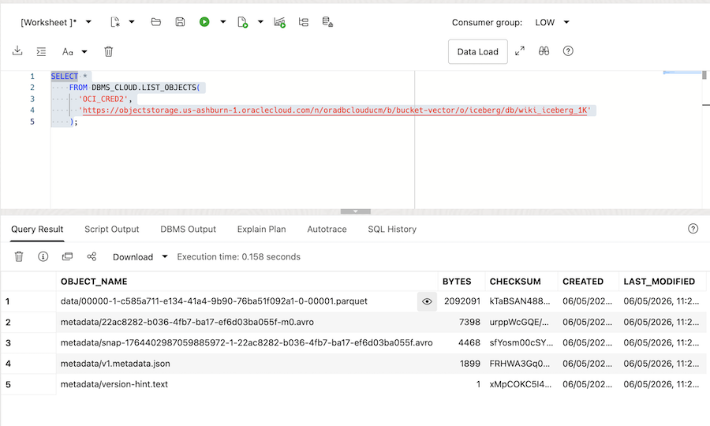
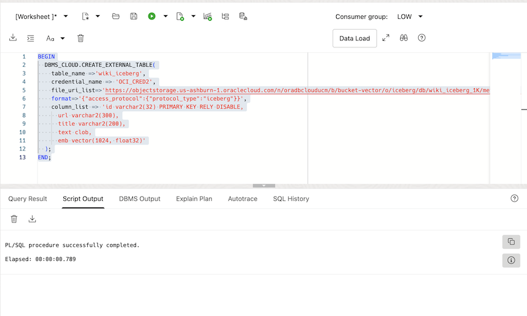
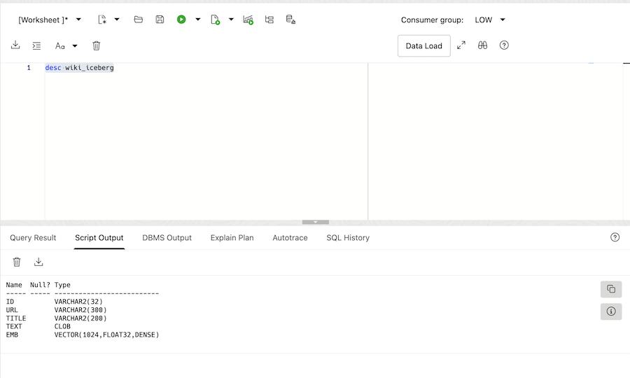
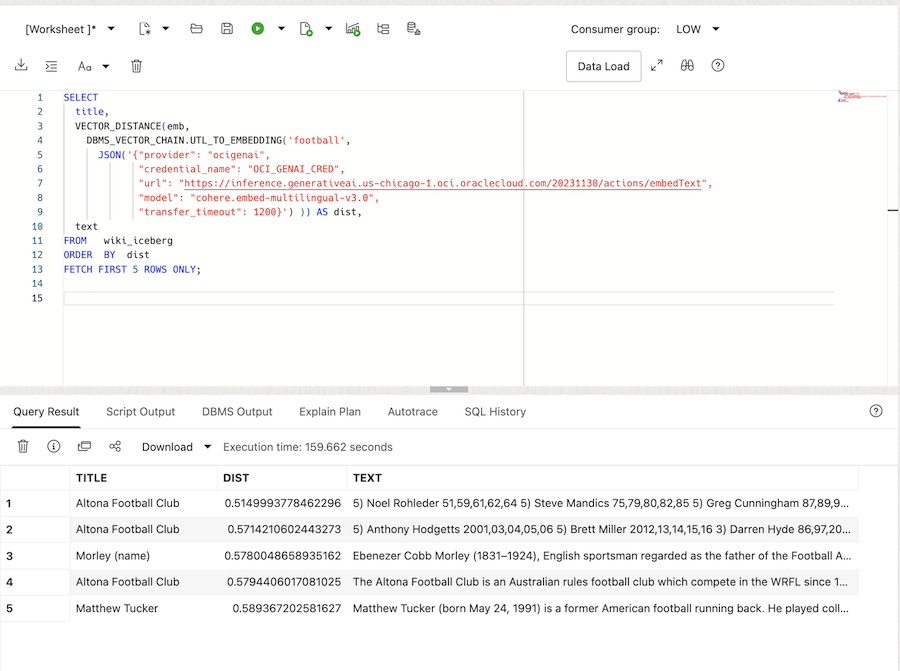
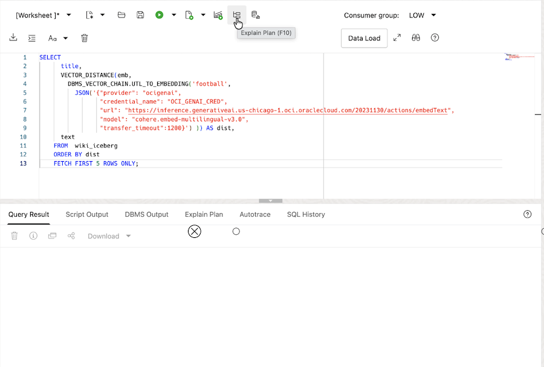
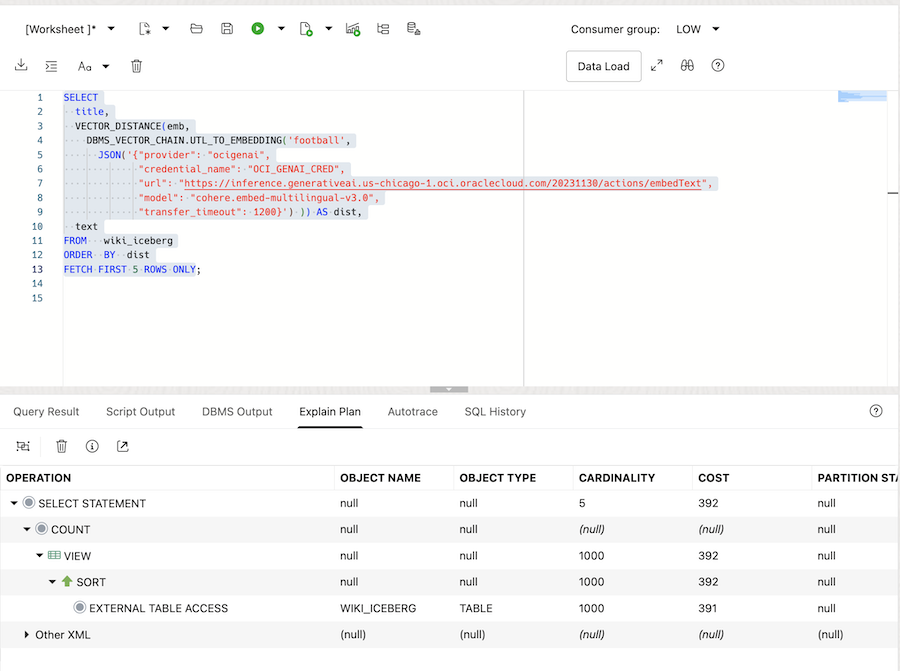
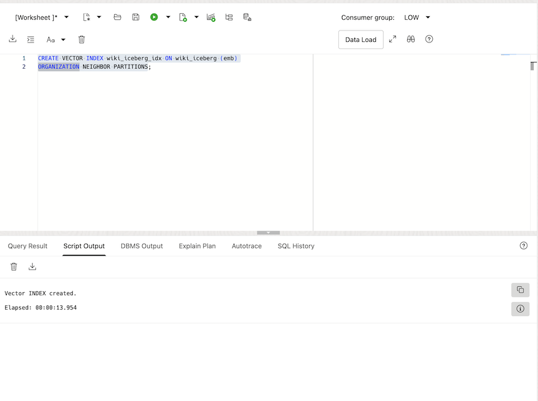
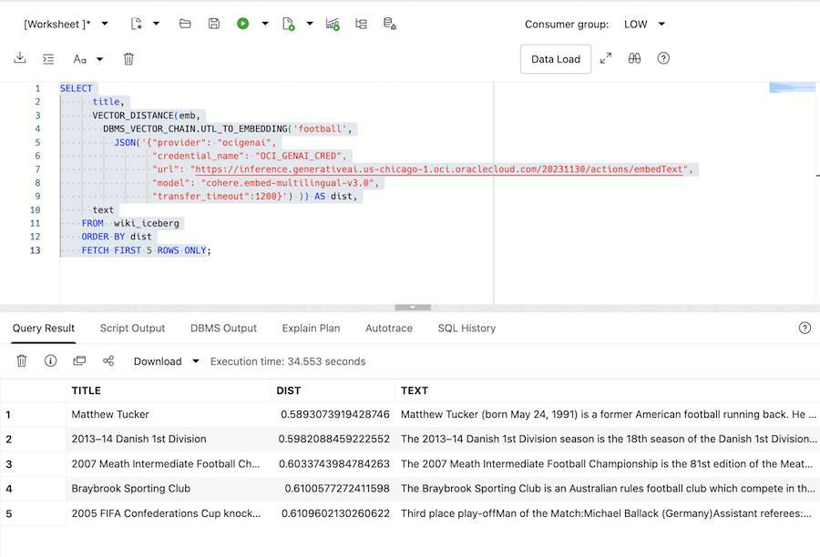
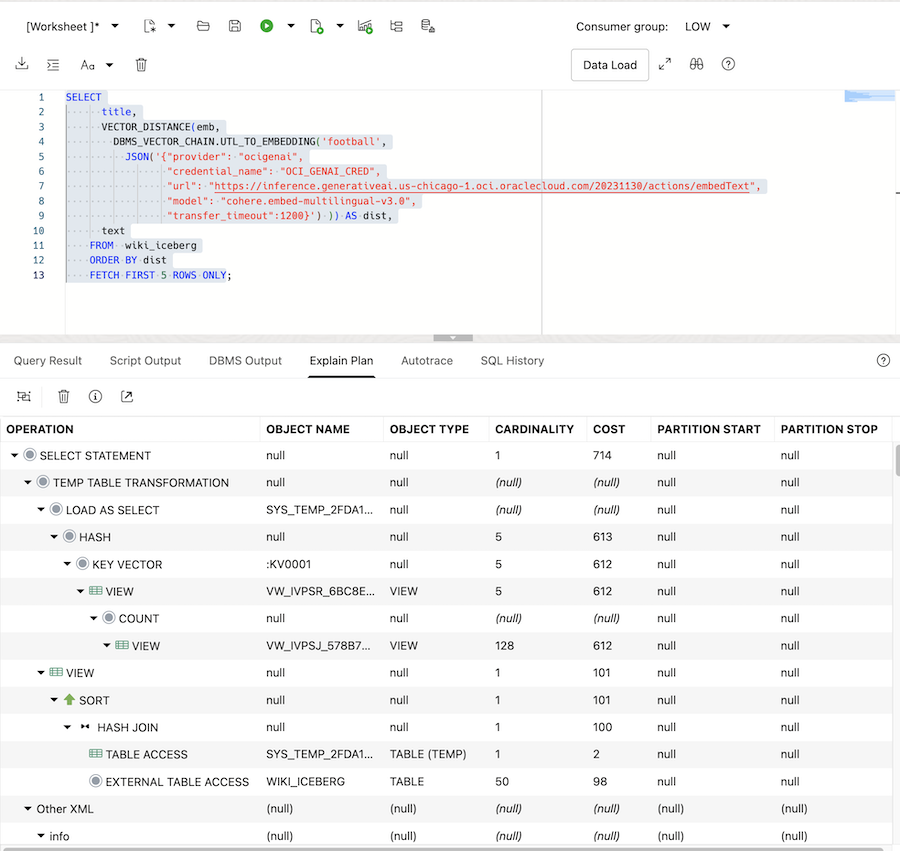
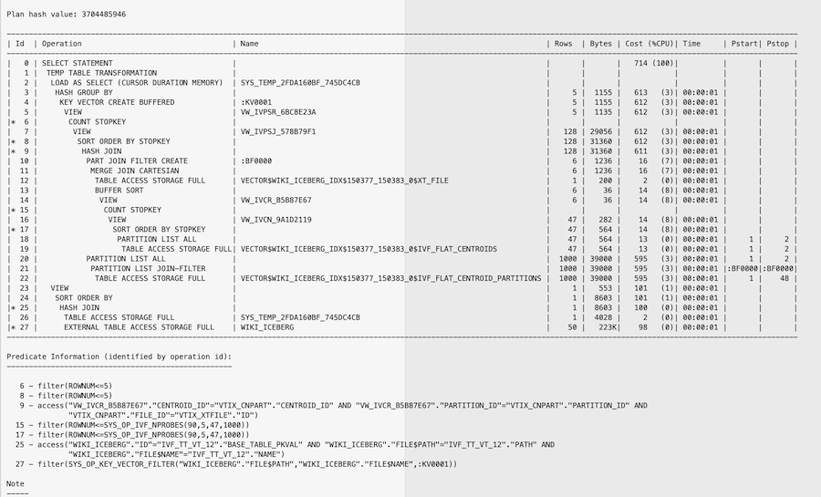

# Similarity Search on Iceberg Tables

## Introduction

This lab walks you through the steps to run a similarity search on an Iceberg table and then create a vector index on the Iceberg table and repeat the similarity search.

Watch the video below for a quick walk-through of the Similarity Search on Iceberg Tables lab:

[Iceberg Similarity Search](https://videohub.oracle.com/media/Vector-Search-Exhaustive-Search-Lab/1_cmymq19w)

Estimated Time: X

### What is Apache Iceberg

Apache Iceberg is an open source table format designed to simplify the management of vast data lakes and data lakehouses while improving query performance.

Iceberg tables differ from traditional relational tables found in databases such as Postgres, MySQL, or Oracle. Relational tables store both metadata and data in the database where the data is processed and are well suited for structured application data. Moreover, strict relationships between tables in the database can be enforced. Iceberg tables, on the other hand, store both data and metadata in some form of file system storage layer, such as your local file system, Amazon S3, Google Cloud Storage, or Oracle Object Storage. This separation of data and metadata storage and compute decouples data processing from the data itself and gives end users the flexibility to choose the processing engine that is right for their specific needs.

For more information about Apache Iceberg tables see [What Is Apache Iceberg? Understanding Iceberg Tables](https://www.oracle.com/autonomous-database/apache-iceberg/).

### Part 1 - Similarity Search on Iceberg Tables

The first part of this Lab will focus on performing a similarity search on an Iceberg table. We will create an external table to access the Iceberg table data since it is located in Object Storage which is external to Oracle AI Database. The Oracle external table format supports the VECTOR data type and makes the access of Iceberg tables transparent within Oracle AI Database.

In this Lab we have already created the Iceberg table on OCI Object Storage. The table is based on Wikipedia data and the dataset is available on [Hugging Face](https://huggingface.co/datasets/CohereLabs/wikipedia-2023-11-embed-multilingual-v3). The dataset was created by CohereLabs using the [Cohere Embed V3 embedding model](https://txt.cohere.com/introducing-embed-v3/) to create the vector embeddings. We are just using a small 1000 article subset of the data for this Lab. The files on Hugging Face were distributed as Parquet files and we used Python and Spark SQL scripts to create the actual Iceberg table.

### Part 2 - Vector Indexes on Iceberg Tables (Vectors on Ice)

In the second part of this Lab you will create a Vector Index, also known as Vectors on Ice, on the external Iceberg table to significantly improve the search performance of the similarity search query we ran in the first part of the Lab. We will compare the SQL execution plan to the original plan that was generated in the first part of the Lab to show how you can verify that the vector index was used.

### Objectives

In this lab, you will:

* Run queries to discover the characteristics of an Iceberg table stored in OCI Object Store
* Run similarity search on an Iceberg table and investigate the database execution plan
* Create a vector index on the Iceberg table's VECTOR column
* Run another similarity search on the Iceberg table using the vector index and investigate the database execution plan to see how the index was used.

### Prerequisites

This lab assumes you have:

* An Oracle Account (oracle.com account)
* All previous labs successfully completed

## Task 1: Investigate the Iceberg Table

Iceberg tables can have two different formats, they can be Manifest-file based or they can be Catalog-backed. If you're interested in these two different formats more information is available here: [Apache Iceberg Tables Overview](https://docs.oracle.com/en/database/oracle/oracle-database/26/sutil/oracle_bigdata-accessing-apache-iceberg.html#GUID-C88E404B-77C1-45EF-BA2C-5F3F8CA1B3E3). In this Lab we will use a Manifest-file based Iceberg table.

1. The Iceberg table is stored in OCI Object Storage in a storage bucket. You can query different parts of the Iceberg table with the following SQL:

    ```[]
    <copy>
    SELECT *
    FROM DBMS_CLOUD.LIST_OBJECTS(
      'ICEBERG_OCI_CRED',
      'https://objectstorage.us-phoenix-1.oraclecloud.com/n/idxtq30nokep/b/ai-vector-iceberg-48735/o/iceberg/db/wiki_iceberg_1K'
    );
    </copy>
    ```

    The output should show you something similar to the following. Note the data/\*.parquet is the parquet file, or the actual data, and the metadata/ files are the metadata that describes how to access the data.

    

## Task 2: Create an external table

Next we will create an external table so that we can access our Iceberg table.

1. Run the following SQL to create an external table named WIKI\_ICEBERG:

    ```[]
    <copy>
    BEGIN
      DBMS_CLOUD.CREATE_EXTERNAL_TABLE(
        table_name =>'wiki_iceberg',
        credential_name => 'ICEBERG_OCI_CRED',
        file_uri_list=>'https://objectstorage.us-phoenix-1.oraclecloud.com/n/idxtq30nokep/b/ai-vector-iceberg-48735/o/iceberg/db/wiki_iceberg_1K/metadata/v1.metadata.json',
        format=>'{"access_protocol":{"protocol_type":"iceberg"}}',
        column_list => 'id varchar2(32) PRIMARY KEY RELY DISABLE,
          url varchar2(300),
          title varchar2(200),
          text clob,
          emb vector(1024, float32)'
      );
    END;
    </copy>
    ```

    

    Notice that we have explicitly specified the columns for the table using Oracle data types including the VECTOR data type for the vector embedded column. Also note that we have referenced the storage location in our Object Storage bucket for the Iceberg table.

## Task 3: Run a describe on the new table

In this task we will run a describe on the new table to verify the columns created.

1. Run the following to describe the table columns:

    ```[]
    <copy>
    DESC wiki_iceberg
    </copy>
    ```

    The output should look like the following:

    

    Notice the EMB column has a VECTOR datatype.

## Task 4: Run a similarity search on the Iceberg Table

In this task we will run a similarity search on the Iceberg table data by accessing the external table we just created.

1. The following query will search for Wikipedia articles about football. In this Lab we are using the OCI Gen AI service to access the same "cohere.embed-multilingual-v3.0" embedding model that was used to create the data vectors in the Iceberg table. Run the following query:

    ```[]
    <copy>
    SELECT
      w.title,
      VECTOR_DISTANCE(w.emb,
        (SELECT DBMS_VECTOR_CHAIN.UTL_TO_EMBEDDING('football',
           JSON('{"provider": "ocigenai",
                  "credential_name": "AI_CREDENTIAL",
                  "url": "https://inference.generativeai.us-chicago-1.oci.oraclecloud.com/20231130/actions/embedText",
                  "model": "cohere.embed-multilingual-v3.0",
                  "transfer_timeout":1200}'))) ) AS dist,
      w.text
    FROM  wiki_iceberg w
    ORDER BY dist
    FETCH FIRST 5 ROWS ONLY;
    </copy>
    ```

    

    We have included the vector distance, that is the distance between the 'football' vector and the data vector. The closest match is first and then the next four closest matches are next.

2. The last step in this task is to take a look at the execution plan. Since we have not created any indexes we will expect to see a FULL TABLE SCAN of the WIKI\_ICEBERG table.

    Click on the Explain Plan button to display an execution plan. See the following image:

    

    You should see an execution plan similar to the following:

    

## Task 5: Create a vector index on the Iceberg Table

In this task we will create a vector index on the Iceberg table.

1. Run the following statement to create a vector index on the EMB column in the WIKI\_ICEBERG table, which is the VECTOR column where the vector embeddings for the TEXT column are stored. Note that although the Iceberg table is stored in Object Storage the vector index will be created and stored in Oracle AI Database.

    ```[]
    <copy>
    CREATE VECTOR INDEX wiki_iceberg_idx ON wiki_iceberg (emb)
    ORGANIZATION NEIGHBOR PARTITIONS;
    </copy>
    ```

    

## Task 6: Run the similarity search a second time

Now that you have created a vector index you can run the same similarity search you ran in Task 4. The query execution should take advantage of the vector index and run much faster and access many fewer vectors.

1. Run the following query:

    ```[]
    <copy>
    SELECT
      w.title,
      VECTOR_DISTANCE(w.emb,
        (SELECT DBMS_VECTOR_CHAIN.UTL_TO_EMBEDDING('football',
           JSON('{"provider": "ocigenai",
                  "credential_name": "AI_CREDENTIAL",
                  "url": "https://inference.generativeai.us-chicago-1.oci.oraclecloud.com/20231130/actions/embedText",
                  "model": "cohere.embed-multilingual-v3.0",
                  "transfer_timeout":1200}'))) ) AS dist,
      w.text
    FROM  wiki_iceberg w
    ORDER BY dist
    FETCH FIRST 5 ROWS ONLY;
    </copy>
    ```

    

    This time the query should have run much faster, and notice that the results might not be the same. Recall that a similarity search using a vector index is an **approximate** search, not exhaustive. That means that not all of the vectors were compared and therefore the search may produce slightly different results.

2. Now click on the Explain Plan button to display an execution plan. See the following image:

    

    You should see an execution plan similar to the following:

    

    You might notice that the plan is a bit difficult to decipher to identify the use of the index. Here is what it looks like using DBMS\_XPLAN:

    

## Learn More

* [Oracle AI Vector Search Users Guide](https://docs.oracle.com/en/database/oracle/oracle-database/26/vecse/index.html)
* [OML4Py: Leveraging ONNX and Hugging Face for AI Vector Search](https://blogs.oracle.com/machinelearning/post/oml4py-leveraging-onnx-and-hugging-face-for-advanced-ai-vector-search)
* [Oracle Database 26ai Release Notes](https://docs.oracle.com/en/database/oracle/oracle-database/23/rnrdm/index.html)
* [Oracle Documentation](http://docs.oracle.com)

## Acknowledgements

* **Author** - Andy Rivenes, Product Manager, AI Vector Search
* **Contributors**
* **Last Updated By/Date** - Andy Rivenes, Product Manager, AI Vector Search, August 2026
