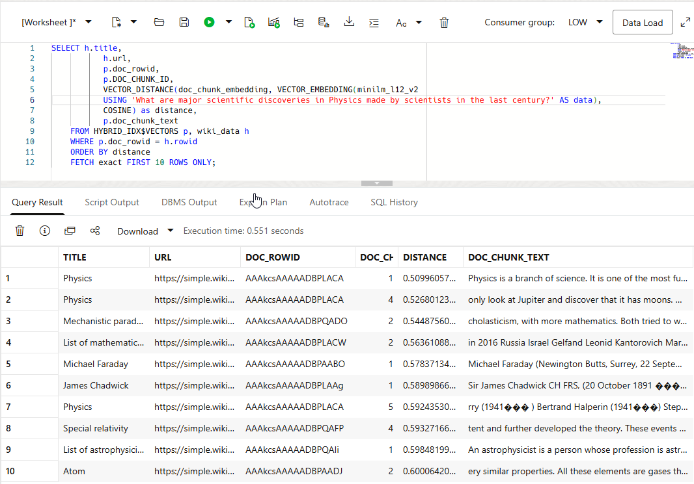
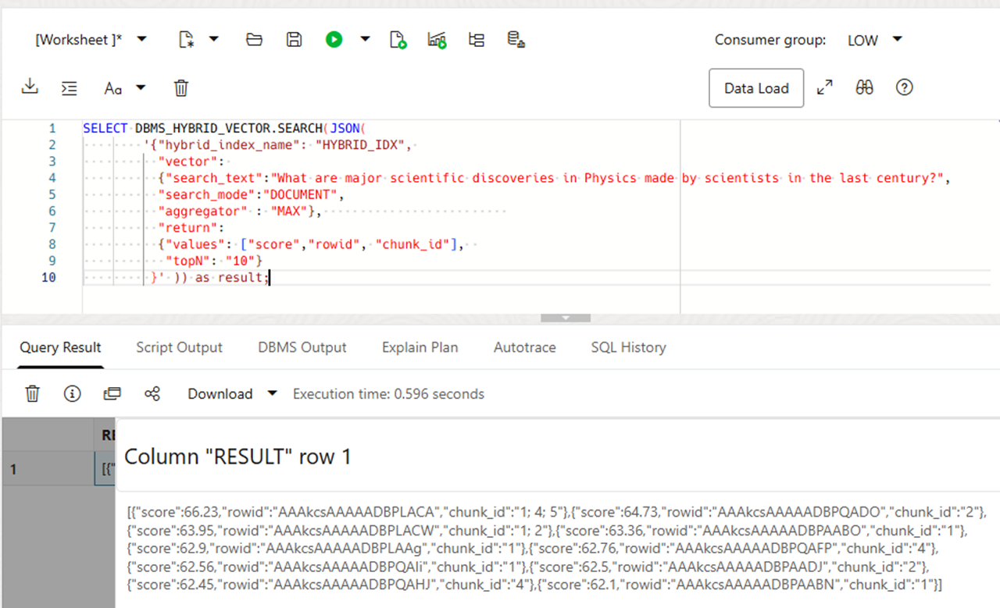
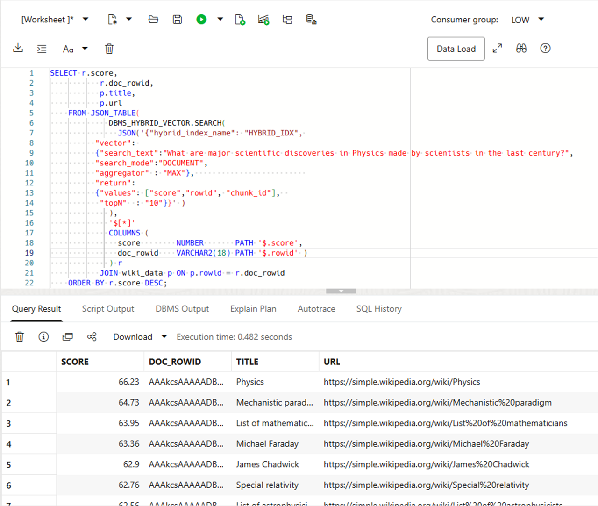
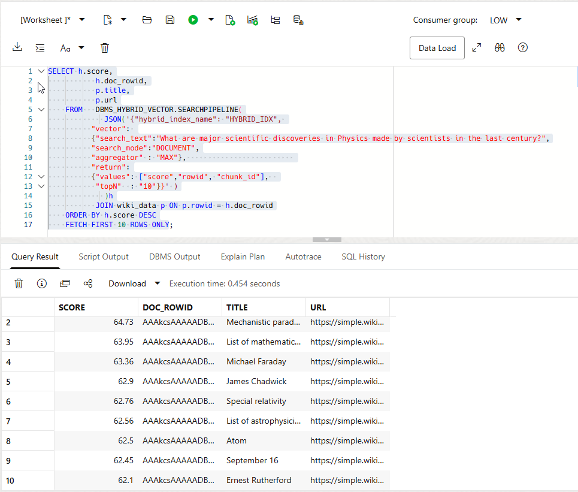

# Similarity Search (Vector-Only)

## Introduction

Hybrid vector indexes let you index and query documents with full-text and semantic vector search. One index contains both text and vector data, so it can support keyword, semantic, and hybrid searches.

In the previous lab, you created the `HYBRID_IDX` hybrid vector index. You used the `MY_VECTORIZER_PREF` vectorizer preference to define chunking, embedding, and vector-index settings. You also inspected the index metadata.

In this lab, you first use SQL to rank document chunks by vector distance. The `HYBRID_IDX$VECTORS` view exposes the chunks, embeddings, chunk IDs, and source row IDs created by `HYBRID_IDX`; join the results to `WIKI_DATA` to retrieve the corresponding source documents.

To query a hybrid vector index directly, use `DBMS_HYBRID_VECTOR.SEARCH` or the `DBMS_HYBRID_VECTOR.SEARCHPIPELINE` table function. The API can perform keyword, semantic, or hybrid searches. 

For hybrid searches, Oracle combines keyword and vector results into one single ranked result set. Fusion controls which results are retained - for example, UNION (the default) keeps results by either search, while INTERSECT keeps only results returned by both the text and vector searches. Scoring then calculates a final relevance score for each retained result using Relative Score Fusion (RSF), Reciprocal Rank Fusion (RRF), or Weighted Reciprocal Rank Fusion (WRRF). Vector-only and text-only searches produce a single result set, so they do not require fusion.

### Search Modes

You can query a Hybrid Vector Index with several vector and keyword search modes. The following list shows the available modes.

- Pure semantic search in Document Mode: Performs vector similarity search over chunks, then aggregates matching chunk scores per document to return the most semantically relevant documents.
- Pure semantic search in Chunk Mode: Performs vector similarity search and returns the individual chunks whose embeddings are most semantically similar to the query.
- Pure keyword search in Document Mode: Performs an Oracle Text CONTAINS search and returns the documents with the highest keyword-match scores.
- Combined keyword and semantic search in Document Mode: Runs Oracle Text and vector similarity searches, aggregates vector matches by document, then fuses the keyword and semantic scores to rank documents.
- Combined keyword and semantic search in Chunk Mode: Runs keyword and vector searches, associates keyword-matching documents with their relevant vector-matching chunks, then fuses the scores to rank chunks.

### Result Formats

The two API functions return results in different formats.

- `DBMS_HYBRID_VECTOR.SEARCH` returns JSON. Use `JSON_TABLE` to convert that JSON into rows and columns for SQL.
- `DBMS_HYBRID_VECTOR.SEARCHPIPELINE` is a pipelined table function. It returns rows directly, so you can join and filter them in SQL.

This lab focuses on pure semantic search in document mode. First, you use `DBMS_HYBRID_VECTOR.SEARCH` and inspect its JSON output. Next, you use `JSON_TABLE` to convert the result to relational rows. Finally, you use `DBMS_HYBRID_VECTOR.SEARCHPIPELINE` to return rows directly and join them with `WIKI_DATA`.

You compare the approaches and learn when to use each one. The API accepts a JSON specification for all query parameters.

### Objectives

In this lab, you will:

- Run an exact chunk-level semantic similarity with `VECTOR_DISTANCE` in SQL using the `HYBRID_IDX$VECTORS` view.
- Run document-level vector-only retrieval with `DBMS_HYBRID_VECTOR.SEARCH`.
- Project the JSON response into relational rows with `JSON_TABLE`.
- Query the same index through `DBMS_HYBRID_VECTOR.SEARCHPIPELINE`.

Follow the four tasks below.

Estimated Time: 20 minutes

### Prerequisites

- Complete the preceding lab.
- Confirm that the `HYBRID_IDX` has the status `INDEXED`.

---

## Task 1: Query Chunks Directly with VECTOR\_DISTANCE

The `HYBRID_IDX$VECTORS` view exposes the chunks and embeddings created for the hybrid vector index. Query the view directly to see how SQL ranks individual chunks by cosine distance.

1. Run the exact similarity-search query.

    ```[]
    <copy>
    SELECT h.title,
           h.url,
           p.doc_rowid,
           p.doc_chunk_id,
           VECTOR_DISTANCE(
             p.doc_chunk_embedding,
             VECTOR_EMBEDDING(
               minilm_l12_v2 USING
               'What are major scientific discoveries in Physics made by scientists in the last century?'
               AS data),
             COSINE) AS distance,
           p.doc_chunk_text
    FROM   hybrid_idx$vectors p
           JOIN wiki_data h ON p.doc_rowid = h.rowid
    ORDER BY distance
    FETCH exact FIRST 10 ROWS ONLY;
    </copy>
    ```

    `VECTOR_EMBEDDING` creates an embedding for the question. `VECTOR_DISTANCE` compares it with each stored chunk embedding. Lower cosine-distance values rank first. `FETCH EXACT` evaluates every eligible vector, so it returns exact results. For large datasets, indexed approximate search is usually faster.

2. Review the results.

    The query returns chunks, not documents. A source document can appear more than once when several of its chunks match. In this example, the document titled `Physics` appears three times, for chunk 1, 4, and 5.

    

## Task 2: Run Document-Level Vector Retrieval with DBMS\_HYBRID\_VECTOR.SEARCH

`DBMS_HYBRID_VECTOR.SEARCH` accepts a JSON request and returns a JSON result. This request uses vector search only and returns document-level results. The query works directly on the Hybrid Vector Index; it does not explicitly reference the source table.

1. Run the query.

    ```[]
    <copy>
    SELECT DBMS_HYBRID_VECTOR.SEARCH(JSON(
        '{"hybrid_index_name": "HYBRID_IDX",
          "vector": 
          {"search_text":"What are major scientific discoveries in Physics made by scientists in the last century?",
          "search_mode":"DOCUMENT",
          "aggregator" : "MAX"},
          "return":
          {"values": ["score","rowid", "chunk_id"],
           "topN"  : 10}
         }' )) AS result;
    </copy>
    ```

    `hybrid_index_name` identifies the index. Oracle embeds `search_text` and compares it with indexed chunk vectors. `DOCUMENT` mode groups matching chunks by source document. `MAX`, the default aggregator, uses the best chunk score for each document. The `return` clause requests the score, row ID, and chunk ID. `topN` limits the response to ten documents.

2. Inspect the result.

    Each JSON object includes the source `rowid`, the overall `score`, `vector_score`, and one or more `chunk_id` values. In this example, the document with row ID `AAAkcsAAAAADBPLACA` has chunk IDs 1, 4, and 5. Because this is a vector-only query, the final score reflects the vector result. Higher scores indicate stronger relevance in this API.

    

## Task 3: Project the JSON response into relational rows

Use `JSON_TABLE` when you need to join the `SEARCH` response with `WIKI_DATA` or use it in a larger SQL statement.

1. Run the query.

    ```[]
    <copy>
    SELECT r.score,
           r.doc_rowid,
           p.title,
           p.url
    FROM JSON_TABLE(
             DBMS_HYBRID_VECTOR.SEARCH(
               JSON('{"hybrid_index_name": "HYBRID_IDX",
          "vector":
          {"search_text":"What are major scientific discoveries in Physics made by scientists in the last century?",
           "search_mode":"DOCUMENT",
           "aggregator" : "MAX"},
          "return":
          {"values": ["score","rowid", "chunk_id"],
           "topN"  : 10}}' )
             ),
             '$[*]'
             COLUMNS (
               score        NUMBER       PATH '$.score',
               doc_rowid    VARCHAR2(18) PATH '$.rowid' )
             ) r
           JOIN wiki_data p ON p.rowid = r.doc_rowid
    ORDER BY r.score DESC;
    </copy>
    ```

2. Compare the output with Task 2.

    The query presents the API output as relational rows. It also adds `TITLE` and `URL` from `WIKI_DATA`.

    

## Task 4: Query the index with SEARCHPIPELINE

`DBMS_HYBRID_VECTOR.SEARCHPIPELINE` returns a pipelined table. You can join and filter the result directly in SQL.

1. Run the query.

    ```[]
    <copy>
    SELECT h.score,
           h.doc_rowid,
           p.title,
           p.url
    FROM   DBMS_HYBRID_VECTOR.SEARCHPIPELINE(
             JSON('{"hybrid_index_name": "HYBRID_IDX",
          "vector":
          {"search_text":"What are major scientific discoveries in Physics made by scientists in the last century?",
          "search_mode":"DOCUMENT",
          "aggregator" : "MAX"},
          "return":
          {"values": ["score","rowid", "chunk_id"],
           "topN"  : 10}}' )
             ) h
           JOIN wiki_data p ON p.rowid = h.doc_rowid
    ORDER BY h.score DESC
    FETCH FIRST 10 ROWS ONLY;
    </copy>
    ```

2. Compare the output with Task 3.

    Both tasks perform pure semantic retrieval in document mode. Use `SEARCHPIPELINE` when the application needs relational rows. Use `SEARCH` when it needs the JSON document.

    

    You now have a semantic-search baseline at both the chunk and document level. In the next lab, add a text clause and choose a fusion strategy to combine semantic relevance with keyword requirements.

    **Proceed to the next lab**

## Learn More

- [Perform Exact Similarity Search](https://docs.oracle.com/en/database/oracle/oracle-database/26/vecse/perform-exact-similarity-search.html)
- [SEARCH](https://docs.oracle.com/en/database/oracle/oracle-database/26/vecse/search.html)
- [SEARCHPIPELINE](https://docs.oracle.com/en/database/oracle/oracle-database/26/vecse/searchpipeline.html)
- [Understand Hybrid Search](https://docs.oracle.com/en/database/oracle/oracle-database/26/vecse/understand-hybrid-search.html)

## Acknowledgements

**Author** - - Ulrike Schwinn, Product Manager, AI Vector Search
**Contributors** - Andy Rivenes, Product Manager, AI Vector Search
**Last Updated By/Date** - Ulrike Schwinn, August 2026
